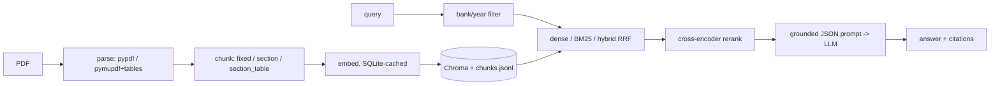

# BankLens — Grounded Q&A and Claim Verification over Bank Annual Reports

RAG over the FY2024 and FY2025 annual reports of JPMorgan Chase, Bank of America, Citigroup and Wells Fargo.

- **Ask**: question → answer with citations (bank, fiscal year, printed page) and the source page rendered with the passage highlighted.
- **Verify**: claim → `SUPPORTED` / `REFUTED` / `NOT_ENOUGH_INFO` plus evidence passages.

**Research question.** How do PDF parsing, table-aware chunking, hybrid retrieval, metadata filtering and reranking affect
retrieval accuracy, answer correctness, faithfulness and correct abstention on long, table-heavy financial filings?
The app is the delivery vehicle; the evaluation, ablations and error analysis are the contribution.

## Architecture



Every query is logged to `logs/queries.jsonl` (retrieved chunk ids, scores, prompt hash, raw output).

## Setup

```bash
python3.11 -m venv .venv && source .venv/bin/activate
pip install -r requirements.txt
pip install -r requirements-local.txt     # reranker (sentence-transformers, pulls torch)
cp .env.example .env                      # add OPENAI_API_KEY and SEC_USER_AGENT
```

Download the 8 PDFs as described in [data/README.md](data/README.md).

## Run

```bash
python -m scripts.ingest --config configs/05_rerank.yaml            # parse, chunk, embed (cached), index
BANKLENS_CONFIG=configs/05_rerank.yaml uvicorn app.main:app --port 8000
streamlit run ui/streamlit_app.py
# or: docker compose up --build
```

Develop and test for free with `provider: hash` / `provider: fake` (`configs/dev_fake.yaml`); `make test` never calls the API.

## Budget rules

All embeddings and LLM calls are cached in `cache/cache.sqlite` (key = sha256(model + input)), so re-running an eval costs $0.
Spend is appended to `logs/costs.jsonl` and a running total is printed after each eval run. `run_eval` aborts above `--max-cost`
(default $1). Set a hard limit in the OpenAI dashboard too. Check current model names and prices before running and update
`price_in` / `price_out` / `embed_price` in the config if they differ.

## Evaluation

```bash
python -m eval.fetch_xbrl                                  # ground-truth numbers from SEC companyfacts
python -m scripts.ingest --config configs/label.yaml       # free index for the labeling helper
python -m eval.label_helper "CET1 capital ratio" --ticker JPM --year 2025
python -m eval.run_eval --config configs/01_baseline.yaml [--judge] [--limit N] [--retrieval-only]
python -m eval.compare                                     # results table + charts in eval/results/
python -m eval.judge_agreement --export eval/results/05_rerank.json   # then label by hand and rerun
```

`page_index` everywhere is the **1-based PDF page number**; `page_label` is the printed page. Retrieval and citation matches
use the same document and a page within ±1.

| Config | parser | chunking | retrieval | filter | rerank |
|---|---|---|---|---|---|
| 01_baseline | pypdf | fixed 512/64 | dense | no | no |
| 02_pymupdf_tables | pymupdf | section_table | dense | no | no |
| 03_hybrid | pymupdf | section_table | hybrid | no | no |
| 04_filter | pymupdf | section_table | hybrid | yes | no |
| 05_rerank | pymupdf | section_table | hybrid | yes | yes |
| 06_ctx_header (stretch) | pymupdf | section_table + header | hybrid | yes | yes |

### Results

_To be filled in after the runs (see `eval/results/results.md`)._

### Error analysis

_6–8 failures with retrieved chunks and root cause (parsing, chunking, retrieval, filter, generation)._

## Limitations

- "Supported" means the bank reported it, not independently audited truth.
- Answers are dated to the filing (FY2024 / FY2025); facts go stale.
- Chunks never cross page boundaries, so a fact split across pages is retrieved as two chunks.
- LLM-judge bias, mitigated by a human agreement check (Cohen's kappa).
- Small eval set (about 70 items): results are indicative, not statistically conclusive.

Not financial advice.
