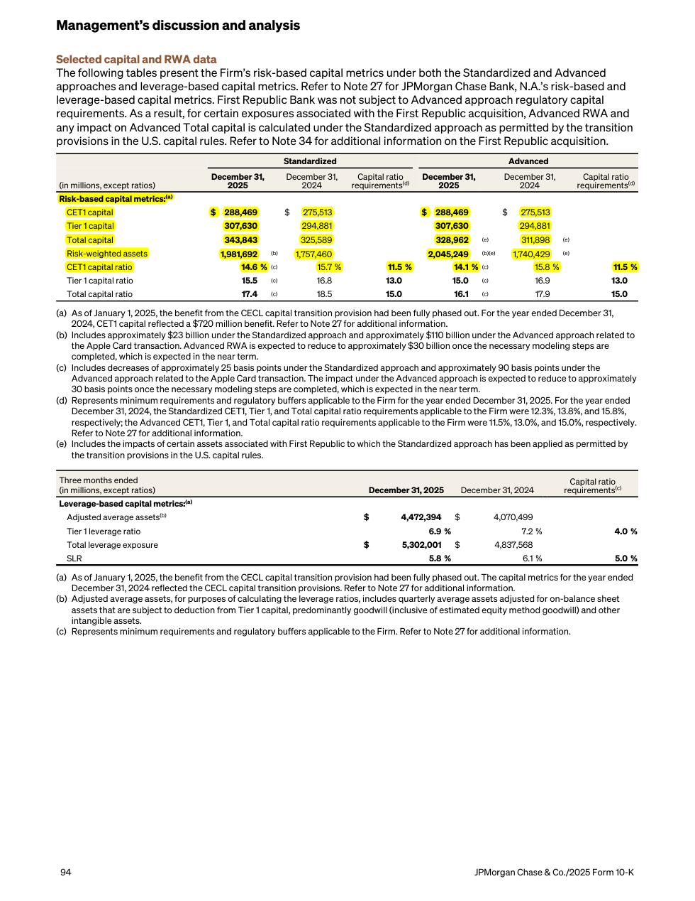
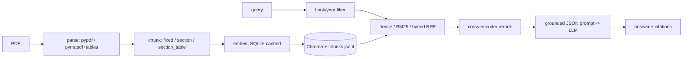

# BankLens — Grounded Q&A and Claim Verification over Bank Annual Reports

RAG over the FY2024 and FY2025 annual reports of JPMorgan Chase, Bank of America, Citigroup and Wells Fargo.

- **Ask**: question → answer with citations (bank, fiscal year, printed page) and the source page rendered with the passage highlighted.
- **Verify**: claim → `SUPPORTED` / `REFUTED` / `NOT_ENOUGH_INFO` plus evidence passages.

**Research question.** How do PDF parsing, table-aware chunking, hybrid retrieval, metadata filtering and reranking affect
retrieval accuracy, answer correctness, faithfulness and correct abstention on long, table-heavy financial filings?
The app is the delivery vehicle; the evaluation, ablations and error analysis are the contribution.

## What it looks like

Each answer comes with clickable citation chips. Selecting one shows the cited passage and the real PDF page with that passage
highlighted (tables are outlined cell by cell). A "How this answer was found" panel lists the retrieved passages and scores.
Verify mode shows a coloured verdict badge (SUPPORTED, REFUTED, NOT ENOUGH INFO) with the evidence.



_Example: the capital table cited for a CET1 question (PDF page 96, printed page 94 of the JPMorgan Chase FY2025 report)._

## Architecture



Every query is logged to `logs/queries.jsonl` (retrieved chunk ids, scores, prompt hash, raw output).

## Setup

```bash
python3.11 -m venv .venv && source .venv/bin/activate
pip install -r requirements.txt
pip install -r requirements-local.txt     # reranker (sentence-transformers, pulls torch)
cp .env.example .env                      # add OPENAI_API_KEY and SEC_USER_AGENT
```

Download the 8 PDFs as described in [data/README.md](data/README.md).

## Run

```bash
python -m scripts.ingest --config configs/05_rerank.yaml            # parse, chunk, embed (cached), index
BANKLENS_CONFIG=configs/05_rerank.yaml uvicorn app.main:app --port 8000
streamlit run ui/streamlit_app.py
# or: docker compose up --build   (provided but not yet tested: Docker was not installed on the dev machine)
```

Develop and test for free with `provider: hash` / `provider: fake` (`configs/dev_fake.yaml`); `make test` never calls the API.

## Budget rules

All embeddings and LLM calls are cached in `cache/cache.sqlite` (key = sha256(model + input)), so re-running an eval costs $0.
Spend is appended to `logs/costs.jsonl` and a running total is printed after each eval run. `run_eval` aborts above `--max-cost`
(default $1). Set a hard limit in the OpenAI dashboard too. Check current model names and prices before running and update
`price_in` / `price_out` / `embed_price` in the config if they differ.

## Evaluation

```bash
python -m eval.fetch_xbrl                                  # ground-truth numbers from SEC companyfacts
python -m scripts.ingest --config configs/label.yaml       # free index for the labeling helper
python -m eval.label_helper "CET1 capital ratio" --ticker JPM --year 2025
python -m eval.run_eval --config configs/01_baseline.yaml [--judge] [--limit N] [--retrieval-only]
python -m eval.compare                                     # results table + charts in eval/results/
python -m eval.judge_agreement --export eval/results/05_rerank.json   # then label by hand and rerun
```

`page_index` everywhere is the **1-based PDF page number**; `page_label` is the printed page. Retrieval and citation matches
use the same document and a page within ±1.

| Config | parser | chunking | retrieval | filter | rerank |
|---|---|---|---|---|---|
| 01_baseline | pypdf | fixed 512/64 | dense | no | no |
| 02_pymupdf_tables | pymupdf | section_table | dense | no | no |
| 03_hybrid | pymupdf | section_table | hybrid | no | no |
| 04_filter | pymupdf | section_table | hybrid | yes | no |
| 05_rerank | pymupdf | section_table | hybrid | yes | yes |
| 06_ctx_header (stretch) | pymupdf | section_table + header | hybrid | yes | yes |

### Results

Eval set: 40 questions (10 factual, 12 numeric, 8 comparison, 10 unanswerable) and 30 claims (7 supported, 15 refuted,
8 not-enough-info) over the 8 filings. Every expected answer was checked by script against the text of its cited PDF
page. The set was drafted with AI assistance, not purely by hand. Full tables: [eval/results/results.md](eval/results/results.md).

| Config | Hit@5 | MRR | Answer correct | Faithfulness (judge, inflated) | Abstain P / R | False abstain | Verify acc | Latency | Cost / run |
|---|---|---|---|---|---|---|---|---|---|
| 01 baseline (pypdf, fixed, dense) | 0.567 | 0.358 | 0.675 | 0.817 | 0.69 / 0.90 | 0.133 | 0.867 | 1.2 s | $0.083 |
| 02 pymupdf tables + section_table | 0.567 | 0.269 | 0.625 | 0.761 | 0.59 / 1.00 | 0.233 | 0.833 | 0.8 s | $0.059 |
| 03 + hybrid (RRF) | 0.533 | 0.227 | 0.675 | 0.833 | 0.63 / 1.00 | 0.200 | 0.833 | 0.9 s | $0.073 |
| 04 + bank/year filter | 0.667 | 0.278 | 0.750 | 0.896 | 0.63 / 1.00 | 0.200 | 0.867 | 0.9 s | $0.068 |
| 05 + cross-encoder rerank | 0.700 | 0.456 | 0.825 | 1.000 | 0.77 / 1.00 | 0.100 | 0.900 | 3.4 s | $0.078 |
| 06 + contextual header (stretch) | 0.633 | 0.493 | 0.850 | 0.940 | 0.83 / 1.00 | 0.067 | 0.867 | 2.7 s | $0.079 |

Answer correctness by type (numeric / factual / comparison): baseline 0.92 / 0.50 / 0.25, best config (06) 0.83 / 0.90 / 0.63.
Total spend for all indexes and runs was about $0.60. Charts: `eval/results/ablation.png`, `eval/results/by_type.png`.

**What the ablation shows** (n=40, so one question is 2.5 points: read differences under about 5 points as noise):

- **Filtering and reranking help most.** The bank/year filter gave the largest gain among cheap steps (Hit@5 0.53 to 0.67).
  Reranking then lifted MRR from 0.28 to 0.46, at roughly 4x the latency on CPU. Its judged faithfulness of 1.000 is an upper bound (see Judge validation).
- **Table-aware parsing alone did not help.** Config 02 matched the baseline on Hit@5 but had lower MRR and numeric correctness
  (0.92 down to 0.67). Parsing better tables is not enough when chunking splits a table away from the row that answers the question.
- **Hybrid retrieval did not help on its own.** BM25 over number-heavy table text added noise until the filter narrowed the pool.
- **Contextual headers (06) improved MRR and abstention** but not Hit@5. The difference from 05 is within noise.
- **Table-aware configs abstain more on answerable questions** (false abstention up to 0.23) because the evidence chunk is often missing.
- **Metric note.** Numeric answers are accepted within 1% or when correct at the precision the answer states
  ("$2.1 trillion" for 2,148.6 billion). The first version used 1% only and wrongly failed correct roundings, so all
  configs were re-scored from cache with the fixed metric.

### Error analysis (config 05 unless noted)

| # | Item | What went wrong | Root cause |
|---|---|---|---|
| 1 | q016 Citi total assets (02 to 05) | The "Total assets" row sat in a different chunk of the same page than the retrieved ones. The model invented 2,022,000 million (02). Config 05 abstained. | **Chunking**: a long balance sheet is split by rows, separating the total from the part that was retrieved. Generation then broke the "only use excerpts" rule. |
| 2 | q010, c005, c012 JPM dividends per share | The row is inside a long 512-token summary table. It was never retrieved, so two claims returned not-enough-info. | **Chunking and retrieval**: a long multi-topic table dilutes row-level facts in both the embedding and the cross-encoder, which truncates at 512 tokens. |
| 3 | q021 JPM Standardized CET1 | The correct, well-aligned table was retrieved, but a regulatory-requirement note ranked first and the model answered 11.5% (the requirement) instead of 14.6%. | **Retrieval (distractor) and generation**: prose about requirements outranks the table, and the model reads the wrong column. |
| 4 | q023, q027, q029 two-bank comparisons | Top 5 came almost entirely from one bank, so the other side of the comparison was missing. | **Retrieval**: the filter keeps both banks but nothing balances results per bank. A multi-entity query needs per-entity retrieval. |
| 5 | q009 WFC headcount | The headcount table row was not retrieved. The answer "over 205,000" came from prose passages and misses the exact 205,198. | **Retrieval**: prose passages outrank the table row. The model rounded instead of abstaining. |
| 6 | c025 relocation rumor | Marked REFUTED because an excerpt mentions a New York headquarters. Nothing contradicts a plan to relocate. | **Generation**: over-inference against the rule that missing information is NOT_ENOUGH_INFO. |
| 7 | q017 WFC total assets (02) | Gave 1,948 billion, a number not in any excerpt. Same pattern as case 1. | **Chunking and generation** |
| 8 | Parser limits seen on real pages | Wrapped row labels split over two rows, a stray "$" lands in the wrong cell (Citi), and BAC section names stick (no bookmarks). | **Parsing** |

Takeaways: the biggest remaining errors come from chunking (a table row separated from its context) and from
multi-entity retrieval, not from the embedding model. Candidate fixes are row-aware table chunks that always repeat the title and
the "Total" rows, per-bank retrieval for comparisons, and a prompt check that every returned number appears in an excerpt.

### Judge validation

I hand-labeled 25 answers from config 05 (10 numeric, 9 factual, 6 comparison) for correctness and faithfulness, without seeing
the judge's verdicts (`python -m eval.label_cli`, then `python -m eval.judge_agreement`).

| | Agreement | Cohen's kappa | Human positive | Automatic / judge positive |
|---|---|---|---|---|
| Correctness | 92% (23/25) | 0.70 | 21/25 | 21/25 |
| Faithfulness | 80% (20/25) | 0.00 | 20/25 | 25/25 |

- **Correctness is trustworthy on this sample.** Numeric and keyword answers are scored by rules and comparison answers by the
  LLM judge. The judge agreed with me on all 6 comparison answers. The two disagreements are rule edge cases: I rejected
  "about $2.1 trillion" for 2,148.6 billion (the precision-aware rule accepts it) and accepted "over 205,000" for 205,198
  (the exact-keyword rule rejects it).
- **The faithfulness judge is too lenient, so the faithfulness column above is inflated.** It scored all 25 answers as fully
  supported, while I flagged 5 as not supported by their cited passages. All 5 are failures also found in the error analysis
  (wrong CET1 column, invented total assets, one-sided comparisons). A kappa of 0.00 means the judge adds no information beyond
  "always faithful". Read faithfulness as an upper bound, not a measurement.
- Next step if continuing: use a stricter judge prompt or a stronger judge model, re-validate on fresh labels (not these 25, to
  avoid tuning on the validation set), and report the corrected faithfulness.

## Limitations

- "Supported" means the bank reported it, not independently audited truth.
- Answers are dated to the filing (FY2024 / FY2025); facts go stale.
- Chunks never cross page boundaries, so a fact split across pages is retrieved as two chunks.
- LLM-judge bias: the faithfulness judge was found too lenient (kappa 0.00 against my labels on 25 answers), so faithfulness scores are upper bounds.
- Small eval set (70 items): results are indicative, not statistically conclusive.
- The eval set was drafted with AI assistance and verified against the cited pages by script, not written purely by hand.
- Page-label detection is heuristic and BAC pages without a printed footer fall back to the PDF index.

Not financial advice.
